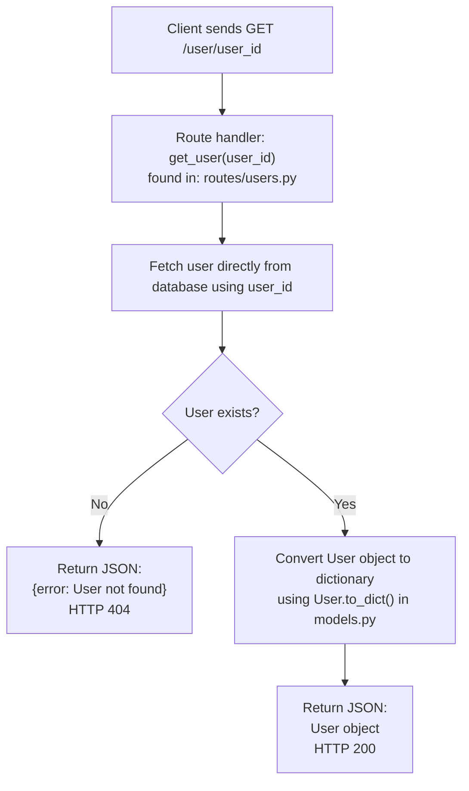
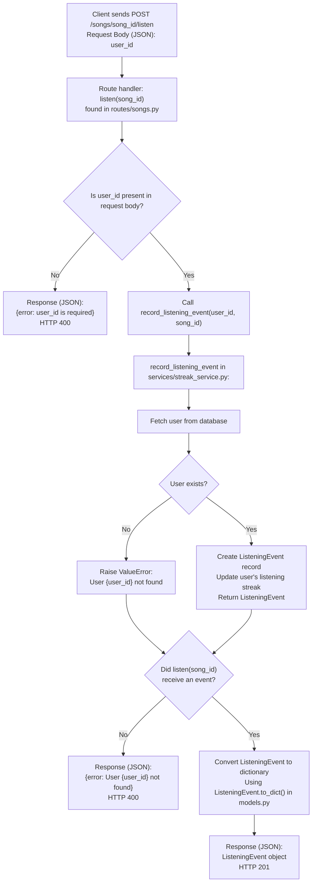

## CodeBase Map 

### `routes/`
This directory contains multiple route files. Each file defines the routes for a specific entity, e.g., playlists, 
users, or songs.

The routes handle little to no logic, they immediately delegate to a service function. There are a few
exceptions, like fetching a user, which happens directly in the route file.

Input parsing and response formatting is handled by the routes.

#### `feed.py`
Defines the following routes:
* `GET /feed/<user_id>/listening-now`
* `GET /feed/<user_id>/activity`

The routes defined in this file only access services defined in `services/feed_service.py`.

#### `playlists.py`
Defines the following routes:
* `POST /playlists`
* `GET /playlists/<playlist_id>`
* `GET /playlists/<playlist_id>/songs`
* `POST /playlists/<playlist_id>/songs`

The routes defined in this file access services in both `services/playlist_service.py` and 
`services/notification_service.py`.

#### `songs.py`
Defines the following routes:
* `GET /songs/search`
* `GET /songs/<song_id>`
* `POST /songs/<song_id>/rate`
* `POST /songs/<song_id>/listen`

The routes defined in this file access services in `services/search_service.py`,
`services/notification_service.py`, and `services/streak_service.py`.

#### `users.py`
Defines the following routes:
* `GET /users/<user_id>`
* `GET /users/<user_id>/streak`
* `GET /users/<user_id>/notifications`
* `POST /users/notifications/<notification_id>/read`

The routes defined in this file access services in both `services/streak_service.py` and 
`services/notification_service.py`.

### `services/`
This directory contains multiple service files. 

All the business logic is located in these files.

#### `feed_service.py`
Defines functions that handle the "Friends Listening Now" feed and activity feed logic:
* `get_friends_listening_now(user_id: str) -> list[dict]`
* `get_activity_feed(user_id: str, limit: int = 20) -> list[dict]`

These functions interact with the following models: `User`, `Song`, `ListeningEvent`.

#### `notification_service.py`
Defines functions that handle creating and retrieving notifications:
* `create_notification(user_id: str, notification_type: str, body: str) -> Notification`
* `add_to_playlist(playlist_id: str, song_id: str, added_by_user_id: str) -> None`
* `rate_song(user_id: str, song_id: str, score: int) -> Rating`
* `get_notifications(user_id: str, unread_only: bool = False) -> list[dict]`
* `mark_as_read(notification_id: str) -> None`

These functions interact with the following models: `Notification`, `Song`, `User`, `Rating`.

#### `playlist_service.py`
Defines functions that handle playlist creation and retrieval logic:
* `create_playlist(name: str, created_by_user_id: str, is_collaborative: bool = True) -> Playlist`
* `get_playlist_songs(playlist_id: str) -> list[dict]`
* `get_playlist(playlist_id: str) -> dict`
* `get_user_playlists(user_id: str) -> list[dict]`

These functions interact with the following models: `Playlist`, `Song`, `User`, `playlist_entries`.

#### `search_service`
Defines functions that handle song search logic:
* `search_songs(query: str) -> list[dict]`
* `get_song(song_id: str) -> dict`

These functions interact with the following models: `Song`, `Tag`, `song_tags`.

#### `streak_service`
Defines functions that handle listening streak logic for users:
* `record_listening_event(user_id: str, song_id: str) -> ListeningEvent`
* `update_listening_streak(user: User, now: datetime) -> None`
* `get_streak(user_id: str) -> int`

These functions interact with the following models: `User`, `ListeningEvent`.

### `app.py`
Serves as the app entry point. Routes are registered, database is configured, and finally app boots up.

### `models.py`
Defines the following SQLAlchemy models:
* `User`
* `Tag`
* `Song`
* `ListeningEvent`
* `Rating`
* `Playlist`
* `Notification`

The following relationships are also defined:
* `friendships`: table for User friendships, many-to-many, symmetric
* `song_tags`: table for Song tags, many-to-many
* `playlist_entries`: table for Playlist songs, many-to-many with ordering

Pattern for all models: ids are V4 UUIDs (don't expect to find integer, auto inc ids).

### Data flow examples
These examples show how some flows behave:

#### Fetch a user


#### User listens to a song


---
## Chosen Bugs
I'll start with these 3 bugs:

| # | Title                                             | Affected service      |
|---|---------------------------------------------------|-----------------------|
| 1 | The same song keeps showing up twice in search    | `search_service.py`   |
| 2 | Friends Listening Now shows people from yesterday | `feed_service.py`     |
| 3 | The last song in a playlist never shows up        | `playlist_service.py` |

---
### Reproducing Bugs
#### The same song keeps showing up twice in search
Steps: 
> This bug could not be reproduced. It seems like the ORM is deduplicating records before returning them.
> 
> Even if the bug could not be reproduced, I was able to confirm the bug exists by directly querying the database.

The following screenshot shows that the current query is duplicating records:


#### Friends Listening Now shows people from yesterday
Steps: 
1. Triggered a "Listening Event" for a friend and change the date to yesterday.
2. Get listening now feed
   ```
   GET /feed/:user_id/listening-now
   
   Inputs: 
   :user_id = b4e0a089-fb4a-4492-97c3-fe7e3d4b4a21
   
   Headers:
   Date: Mon, 06 Jul 2026 15:41:36 GMT
   
   Response:
   HTTP Code 200 OK
   {
        "count": 1,
        "feed": [
            {
                "friend": {
                    "id": "4e1d5321-e7ee-44c3-beba-70131366cf40",
                    "last_listened_at": "2026-07-05T16:39:12.812000",
                    "listening_streak": 1,
                    "username": "nova"
                },
                "listened_at": "2026-07-05T16:39:12.812000",
                "song": {
                    "album": null,
                    "artist": "Borough Kings",
                    "genre": "rap",
                    "id": "2409cfa3-e05b-4e88-81cb-af1f2ee1bb23",
                    "share_note": null,
                    "shared_at": "2026-07-01T19:43:52.151299",
                    "shared_by": "685f04c7-ba96-4caf-966d-665bce16795c",
                    "tags": [
                        "hip-hop",
                        "rap",
                        "boom bap"
                    ],
                    "title": "Crown Heights Anthem"
                }
            }
         ]
       }
   ```
   
This request was made on July 6, 2026, at 15:21 GMT, and the listening event was created on July 5, 2026, at 16:39 GMT.
Listening now should only display records from the last 30 minutes, so this record shouldn't be showing up.


#### The last song in a playlist never shows up
Steps:
1. Get songs from a playlist
    ```
   GET /playlists/:playlist_id/songs
   
   Inputs:
    :playlist_id = baef7ad6-e44a-490f-8347-75e14d1d266d
   
   Response:
    HTTP Code 200 OK
    {
        "count": 6,
        "songs": [
            {
                "album": null,
                "artist": "The Wanderers",
                "genre": "indie rock",
                "id": "d75a173d-c9d5-4983-971f-08307fb7be43",
                "share_note": null,
                "shared_at": "2026-06-27T19:43:52.151299",
                "shared_by": "4e1d5321-e7ee-44c3-beba-70131366cf40",
                "tags": [],
                "title": "Midnight Drive"
            },
            {
                "album": null,
                "artist": "Elara Moon",
                "genre": "ambient",
                "id": "be632b3d-dd3b-4d50-b99e-85300c2744f6",
                "share_note": null,
                "shared_at": "2026-06-27T19:43:52.151299",
                "shared_by": "4e1d5321-e7ee-44c3-beba-70131366cf40",
                "tags": [],
                "title": "Still Waters"
            },
            {
                "album": null,
                "artist": "Coastal Highway",
                "genre": "indie",
                "id": "7a647c47-2eb8-4173-8f15-c869d49a6c4e",
                "share_note": null,
                "shared_at": "2026-06-27T19:43:52.151299",
                "shared_by": "4e1d5321-e7ee-44c3-beba-70131366cf40",
                "tags": [],
                "title": "First Light"
            },
            {
                "album": null,
                "artist": "Street Collective",
                "genre": "hip-hop",
                "id": "eab3ce10-9c73-4f6a-a27b-f2cca9952343",
                "share_note": null,
                "shared_at": "2026-06-29T19:43:52.151299",
                "shared_by": "b4e0a089-fb4a-4492-97c3-fe7e3d4b4a21",
                "tags": [
                    "hip-hop"
                ],
                "title": "Block Party"
            },
            {
                "album": null,
                "artist": "Nova Blix",
                "genre": "lo-fi",
                "id": "4e9d1676-a203-492d-a9ce-c1163ba3258a",
                "share_note": null,
                "shared_at": "2026-06-29T19:43:52.151299",
                "shared_by": "b4e0a089-fb4a-4492-97c3-fe7e3d4b4a21",
                "tags": [
                    "lo-fi"
                ],
                "title": "Late Night Session"
            },
            {
                "album": null,
                "artist": "Solange K",
                "genre": "r&b",
                "id": "bfd0eac7-fd16-45dd-96b1-80c7152ebe89",
                "share_note": null,
                "shared_at": "2026-06-29T19:43:52.151299",
                "shared_by": "b4e0a089-fb4a-4492-97c3-fe7e3d4b4a21",
                "tags": [
                    "r&b"
                ],
                "title": "Golden Hour"
            }
        ]
    }

    ```

The following screenshot shows that in the database, this playlist has 7 associated songs:
